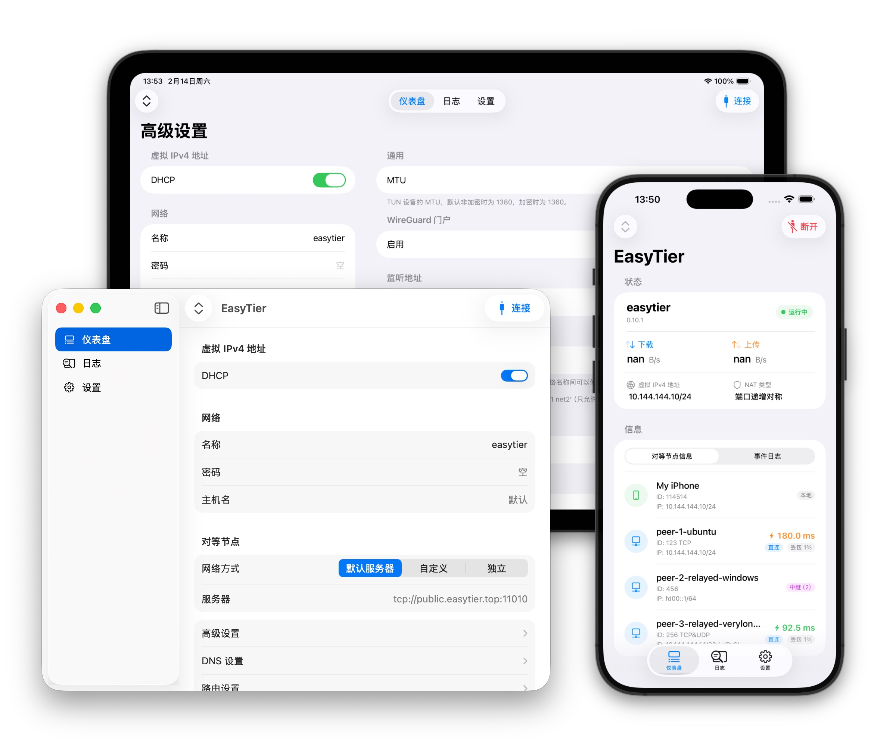

# EasyTier iOS/macOS Client

[简体中文](README_CN.md) | [English](README.md)

iOS/macOS native client application for EasyTier, a decentralized virtual private network solution.

### Overview

This is an iOS/macOS client for EasyTier VPN. It provides a user-friendly interface to connect to EasyTier networks on iOS/macOS devices, with support for Network Extension framework for system-level VPN integration.

### Screenshots

### Installation

You can join our [TestFlight](https://testflight.apple.com/join/YWnDyJfM) for testing.

### License

GNU General Public License v3.0 - See [LICENSE](LICENSE) file

### Project Links

- EasyTier: [EasyTier/EasyTier](https://github.com/EasyTier/EasyTier)
